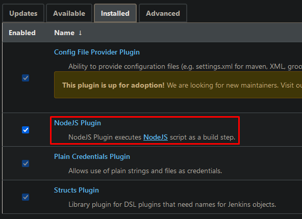
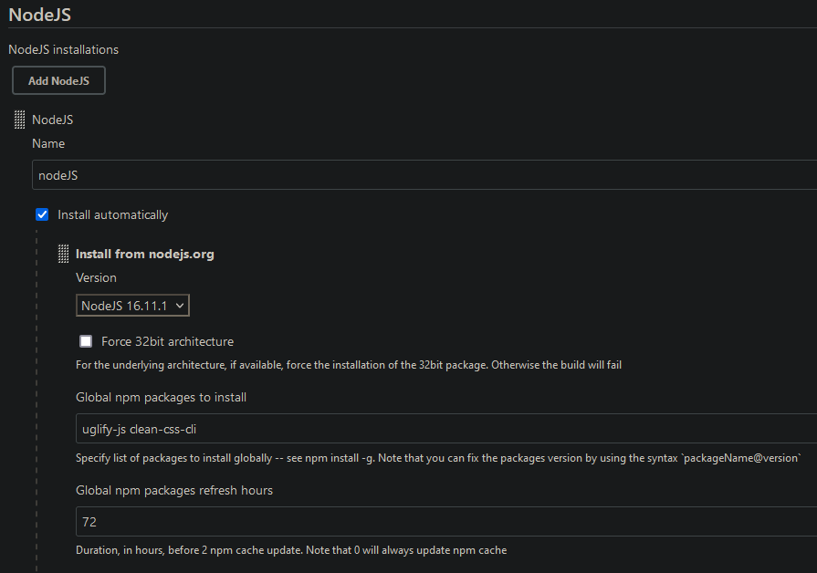

# Lab: simple CI pipeline  
 
# install openjdk-8-jdk, Git 
sudo apt-get install software-properties-common 
sudo add-apt-repository ppa:git-core/ppa 
sudo apt-get update  
sudo apt-get install openjdk-8-jdk git -y 
# later I upgraded to OpenJDK-11-JDK coz Java 11 is the recommended version to run Jenkins on (Jenkins documentation). 
 
# install Jenkins with enabling autostart on startup  
wget -q -O - https://pkg.jenkins.io/debian-stable/jenkins.io.key | sudo apt-key add - 
sudo sh -c 'echo deb https://pkg.jenkins.io/debian-stable binary/ > /etc/apt/sources.list.d/jenkins.list' 
sudo apt-get update 
sudo apt-get install jenkins -y 
sudo systemctl status jenkins.service 
# check line 
    Loaded: loaded (/etc/init.d/jenkins; generated) 
 
# setup custom port 8081 for Jenkins  
sudo vi /etc/default/jenkins 
# change HTTP_PORT=8080 to HTTP_PORT=8081 
sudo systemctl restart jenkins 
# (or akurasu.ln.ua:8081/restart -> Yes) 
# enter Jenkins via web-browser (http://akurasu.ln.ua:8081/) 
# check initialAdminPassword 
sudo cat /var/lib/jenkins/secrets/initialAdminPassword 
 
# plugins – select plugins, add GitHub and Role-based authorization strategy  
# add new user 

 
# 2. Create Agent VM 
# connect agent to master node  
 
# 3. Configure tools – NodeJS 
http://akurasu.ln.ua:8081/pluginManager/available -> install NodeJS Plugin 

# set up ssh connection between Jenkins and agent 

4. Create “Multibranch Pipeline” pipeline job 

