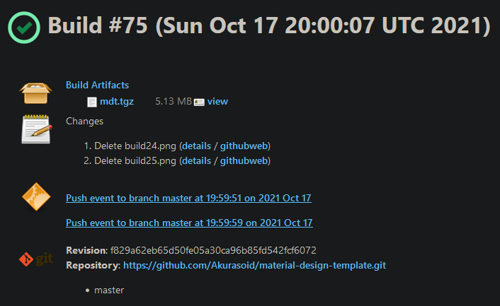

## Lab: simple CI pipeline
### 1. install openjdk-8-jdk, Git on new VM 
    sudo apt-get install software-properties-common
    sudo add-apt-repository ppa:git-core/ppa
    sudo apt-get update
    sudo apt-get install openjdk-8-jdk git -y   
later I upgraded to OpenJDK-11-JDK because Java 11 is the recommended version to run Jenkins on (Jenkins documentation). 
#### install Jenkins with enabling autostart on startup  
    wget -q -O - https://pkg.jenkins.io/debian-stable/jenkins.io.key | sudo apt-key add -
    sudo sh -c 'echo deb https://pkg.jenkins.io/debian-stable binary/ > /etc/apt/sources.list.d/jenkins.list'
    sudo apt-get update
    sudo apt-get install jenkins -y
    sudo systemctl status jenkins.service
#### check line 
> Loaded: loaded (/etc/init.d/jenkins; generated)
#### setup custom port 8081 for Jenkins  
    sudo vi /etc/default/jenkins
#### change HTTP_PORT=8080 to HTTP_PORT=8081 
    sudo systemctl restart jenkins
#### (or akurasu.ln.ua:8081/restart -> Yes) 
#### enter Jenkins via web-browser (http://akurasu.ln.ua:8081/) 
#### check initialAdminPassword 
    sudo cat /var/lib/jenkins/secrets/initialAdminPassword
#### plugins – select plugins, add GitHub and Role-based authorization strategy

#### add new user 

- [x] set up VM with Jenkins - done
### 2. Create Agent VM 
connect agent to master node  
set up ssh connection between Jenkins and agent 

#### Agent status

- [x] Create Agent VM and connect agent to master node - done 
### 3. Configure tools – NodeJS 
http://akurasu.ln.ua:8081/pluginManager/available -> install NodeJS Plugin 
 
#### Add NodeJS

- [x] Configure NodeJS - done
### 4. Create “Multibranch Pipeline” pipeline job
#### Create named folder

#### Archive content

#### logs in "Console Output" file.
- [x] set up pipeline job - done
### 5. Setup the GitHub webhook to trigger the jobs

#### Every time some changes are made in the repository Jenkins makes a new build.
- [x] Setup the GitHub webhook - done

### Spin up VM with installed Artifactory
    wget -O jfrog-deb-installer.tar.gz "https://releases.jfrog.io/artifactory/jfrog-prox/org/artifactory/pro/deb/jfrog-platform-trial-prox/[RELEASE]/jfrog-platform-trial-prox-[RELEASE]-deb.tar.gz"
    tar -xvzf jfrog-deb-installer.tar.gz
    cd jfrog-platform-trial-prox-7.27.6-deb/
    sudo ./install.sh
    sudo systemctl start artifactory.service

#### Then I installed Artifactory Plugin on Jenkins and added a new stage in the pipeline for publishing artifacts into Artifactory 
 

### scripted pipeline - in file "Jenkinsfile.Scripted"
